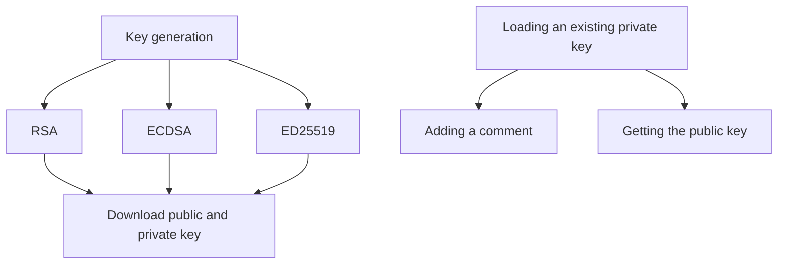

# MacPuTTY
A PuTTYgen emulator designed for Apple Silicon users who cannot use native PuTTYgen.

## What is PuTTYgen?
It is a software used to create keys used for remote connections via SSH.
- In a remote server, the public key of an SSH key pair is added to `~/.ssh/authorized_keys` to allow them to access the server
- To improve security, a lot of enterprise companies protect their virtual private servers with SSH key protection so only authorized devices and users can access their software
> [!NOTE]
> Oftentimes, SSH key-based authentication is tied with another network layer such as a virtual private network (VPN) which tells the server this device is authorized and the VPN belongs to [this] person
- The purpose of PuTTYgen is to develop different forms of keys in a GUI: this includes RSA keys, ECDSA keys and ED25519 keys
- This version (while also accessible to Windows) is for those who do not have access to an interface to create keys

## Architecture

## Installation


> [!NOTE]
> Because we are using Docker, a virtual environment is not required.

> [!WARNING]
> Open the Docker Desktop daemon before running anything, install from [here](https://www.docker.com/products/docker-desktop/).

Clone the repository:
```bash
git clone https://github.com/ayaans16/macPuTTY/
```

Edit `config.conf` to include your `.ssh` repository path:
```conf
directory {
    path = "~/.ssh"
}
```
---
### `docker-compose.yml`
> [!WARNING]
> Edit `docker-compose.yml` to change the port from `5050` to `5000` (or keep it)<br>
> The reason why is (at least for me, on my MacBook), AirPlay was interfering with port `5000`
<details>
  <summary><b>docker-compose.yml</b></summary>

  ```yaml
  services:
  backend:
    build:
      context: .
      dockerfile: Dockerfile
    ports:
      - "5000:5000" # edited this to 5000:5000
    volumes:
      - ./config.conf:/app/config.conf:ro
      - keys:/root/test_ssh
    environment:
      - PYTHONUNBUFFERED=1
    healthcheck:
      test: ["CMD", "python", "-c", "import requests; requests.get('http://localhost:5000/health', timeout=5).raise_for_status()"]
      interval: 30s
      timeout: 10s
      start_period: 40s
      retries: 3
    restart: unless-stopped

volumes:
  keys:
```
</details>

---

> [!IMPORTANT]
> Keep the port at `5000` in `Dockerfile`.

To build the project from scratch, run:
```bash
make build
```
> [!CAUTION]
> If you have any issues during the containerization step, run: `docker compose ps` to ensure it shows a `healthy` status

Electron should open and you will now be able to configure, create and manage SSH keys.


## Future Improvements
> [!TIP]
> - [ ] Fix issues with comments
> - [ ] Visualization of SSH key usage based on a user's `config` file
> - [ ] UI improvements
